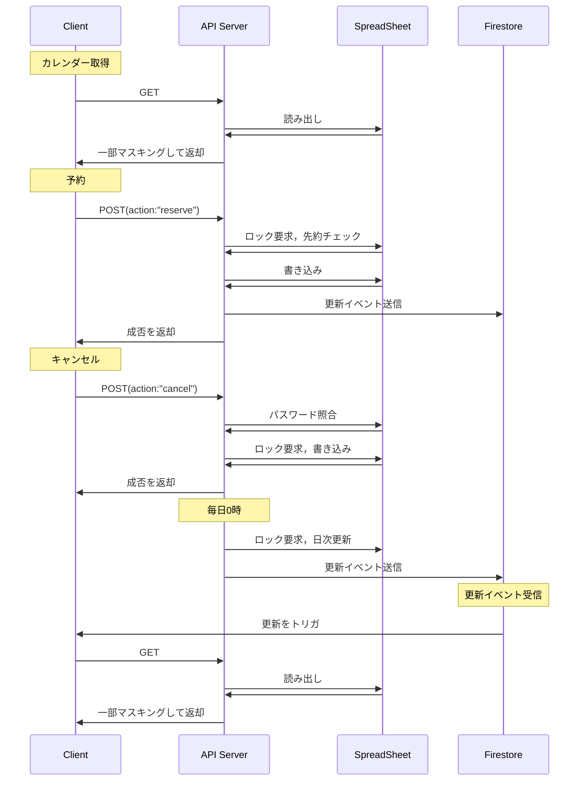

# AR予約システム 仕様書

## これは何？
- 東大音感のARを予約するためのサイトです。
- 画面は Next.js + React + TypeScript で作っています。
- 見た目は MUI、データ取得は React Query、Firebase Firestoreは他の端末での更新を検知するために使います。

## 使い始める手順
1. 依存パッケージを `yarn install` で入れます。
2. `yarn dev` で開発サーバーを起動し、`http://localhost:3000` を開きます。
3. コードチェックは `yarn lint` で行います。

## ディレクトリ構造
| パス | 内容 |
| --- | --- |
| `src/components` | ボタンやダイアログなどの見た目だけの部品。 |
| `src/containers` | データを取りにいき、部品に渡す役。 |
| `src/contexts` | React Context。今はトースト表示用だけ。 |
| `src/libs` | Firebase を初期化するなど外部サービスの設定。 |
| `src/pages` | Next.js のページ。`index.tsx` がトップページ。 |
| `src/services` | API や Firestore とやり取りするフック。 |
| `src/types` | 予約データなどの型定義。 |
| `src/utils` | 共通で使う小さな関数やフック。 |

## 主な画面と動き
1. **トップページ (`pages/index.tsx`)**
   - `GlobalAppBar` でタイトルやリンクを出します。
   - `TimetableViewContainer` が時間割と予約状況を読み込みます。
   - 時間枠を押すと予約用または詳細用のダイアログが開きます。
2. **予約ダイアログ (`ReserveDialogContainer`)**
   - 名前や用途を入力して API に `reserve` を送ります。
   - うまくいくと `ReservationSuccessDialog` とトーストで知らせます。
3. **予約情報ダイアログ (`ReservationInfoDialogContainer`)**
   - 既存の予約内容を表示します。
   - パスワードを入れて `cancel` を送ると予約を削除できます。

## シーケンス図

## 主なコンポーネント
- `GlobalAppBar` : 画面上部のバー。タイトルやリンクを出します。
- `TimetableView` / `TimetableItem` : 日付と時間の表を描き、空き枠には予約ボタン、埋まった枠には詳細ボタンを出します。
- `ReserveDialog` : 予約入力フォーム。React Hook Form を使っています。
- `ReservationInfoDialog` : 予約内容を見たりキャンセルしたりするダイアログ。
- `ReservationSuccessDialog` : 予約が完了したことを伝えるダイアログ。
- `Toast` : `ToastContext` と連携する通知用のスナックバー。

## コンテキスト
- `ToastContext` (`contexts/ToastContext.tsx`)
  - `toast({ message, variant })` を呼ぶと画面右下に短いメッセージが出ます。
  - 予約やキャンセルが成功・失敗したときに使います。

## サービス層（API と Firestore）
- `use-timetable` : `NEXT_PUBLIC_API_URL` から時間割を読み込みます。`useUpdate` と組み合わせて Firestore の変更があれば再読み込みします。
- `use-reserver` : `POST { action: 'reserve' }` で予約を送ります。
- `use-canceler` : `POST { action: 'cancel' }` でキャンセルを送ります。
- `use-update` : Firestore のドキュメントが変わったことを検知するフックです。

## ユーティリティ
- `fetcher.post` (`utils/fetcher.ts`) : `fetch` を使った簡単な POST 用の関数です。
- `useDialog` / `useDataDialog` (`utils/hooks.ts`) : ダイアログの開閉や中身の保持を楽にするフックです。

## 型定義
- `Reservation` : 予約者名・目的・日付・時間枠・同伴者などを持つ型。
- `Timetable` : `dates`, `frames`, `reservations` の3層配列で時間割を表します。
- `PostRequest` / `PostResponse` : API とのやり取りで使う型です。

## Firebase 連携
- `libs/firebase.ts` で環境変数から Firebase アプリを初期化します。
- Firestore の `update/hook` ドキュメントの変更を `use-update` で見張り、他の端末での更新を反映します。
- `firebase.json` と `firestore.rules` は Firestore の設定ファイルです。開発時は緩めの権限になっています。

## 環境変数
| 変数名 | 役割 |
| --- | --- |
| `NEXT_PUBLIC_API_URL` | 予約 API の URL。`/services` で使います。 |
| `NEXT_PUBLIC_FIREBASE_API_KEY` ほか `NEXT_PUBLIC_FIREBASE_*` | Firebase の設定。`libs/firebase.ts` で読み込みます。 |

## 主な依存ライブラリ
- Next.js / React / TypeScript
- Material UI (MUI)
- @tanstack/react-query
- Firebase & react-firebase-hooks
- React Hook Form

## デプロイ
- mainブランチにpushするとGitHub Actionsが走って本番環境に自動でデプロイされます。
- 開発時は必ずブランチを切って作業し、プルリクエストを出してマージすること。（直pushは原則禁止）

## 補足
- ここに書いた内容は 2025 年時点のものです。変更したらこのファイルも直してください。
